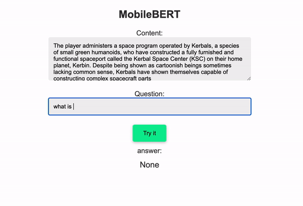

# MobileBERT-Demo
Based on [this MobileBERT repo](https://github.com/gemde001/MobileBERT)

# What is BERT?
BERT (Bidirectional Encoder Representations from Transformers) is a NLP model from Google AI, published in 2018. BERT can do many things, including what is demoed here: Questions and Answers-> pass any text and ask questions about it. 

This demo runs on top of the mobile (lightweight TensorflowLite-based) version. 
On the demo I just copied the Gameplay info about KSP from wikipedia. 

# Demo


## Running the demo locally
### install requirements
* requires python3.
* install dependencies:

```sh
pip3 install -r requirements.txt
```

### download the Model
[Download starter model and vocab](https://www.tensorflow.org/lite/models/bert_qa/overview) 
and copy it to 
```
./demo/mobilebert/
    + vocab.txt
    + mobilebert_float_20191023.tflite
```
and you are all set 😉

### run server
```sh
cd ./demo
python3 main.py
```
* Open http://localhost:5000
* obs:
    - There is a limitation of 384 characters per content string.
    - It's really fast, but not case-sensitive

### The OG code
the Original code from [gemde001](https://github.com/gemde001/MobileBERT) is extremely simple to use, take a look at it:

``` python
  from mobilebert import MobileBERT
  m = MobileBERT()
  answer = m.run(
    "Is KSP a good game?",
    "Kerbal Space Program (KSP) is a sandbox game to build spaceships, it is a good game"
    )

  print(answer)
```
